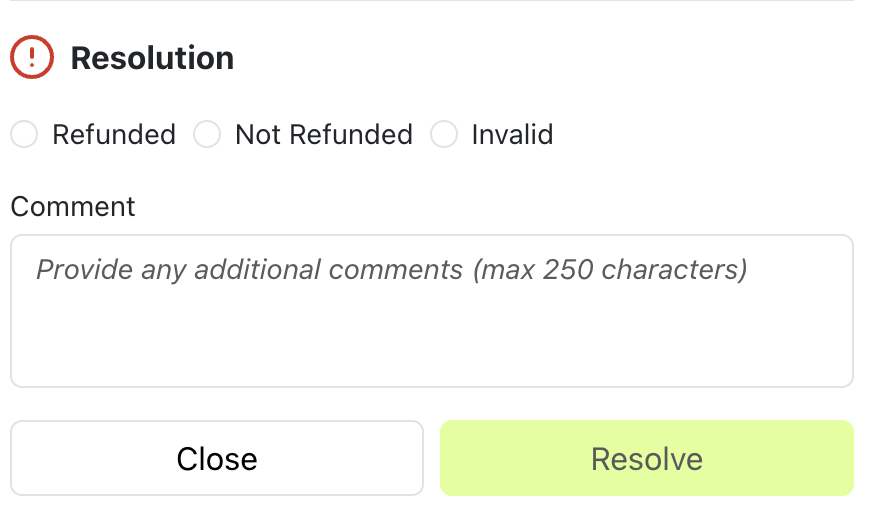

# Working with alerts: best practices to prevent chargebacks

Preventing chargebacks is more important than ever. As your trusted partner, here is a helpful guide to avoid chargebacks and fight fraud.

## Refund Alerts Within 24 Hours

We highly recommend that all Alerts are worked within 24 hours, including your outcome and the refund where applicable. This will allow time for the refund notification to flow back to the issuer with enough time to prevent the chargeback.

After 24hrs mark the alert is marked as "expired" as the chargeback prevention is no longer highly guaranteed.

## Refund the Exact Value of the Alert

Ensure you process a refund for the exact dollar value in the Alert. For example, if you receive an Alert valued at $19.99, but you process a refund for $10.99, this transaction will likely result in a chargeback.

## Ensure the Refund was Successful

Did you receive a notification from your acquirer that the refund was processed? If so, you’re good to go!

## Trusto alerts resolution statuses and recommendation

### Refunded

The transaction was refunded. The customer has been communicated to. The alert has helped to prevent the chargeback

### Not Refunded

The transaction was not refunded. You disagree with the reason of the alert and willing to proceed with a chargeback flow

### Invalid

This status means that the alert was not able to potentially prevent a chargeback and is going to be disputed.
This will be taken by Trusto with the alerts provider for the dispute.
Alert may be flagged as Invalid for one of the following reasons:

| Reason                  | Description                                                                                                                                   |
| ----------------------- | --------------------------------------------------------------------------------------------------------------------------------------------- |
| **Previosly Refunded**  | _Alert has been received after the refund has been made, including failed/reversed auths_                                                     |
| **Chargeback Received** | _The chargeback was already processed before the alert was issued_                                                                            |
| **Duplicate**           | _The same transaction received multiple alerts, making the extra alerts invalid. Note: provide in the comments the ID of the original alert._ |
| **Not Found**           | _The transaction referenced in the alert does not exist in the merchant’s records_                                                            |